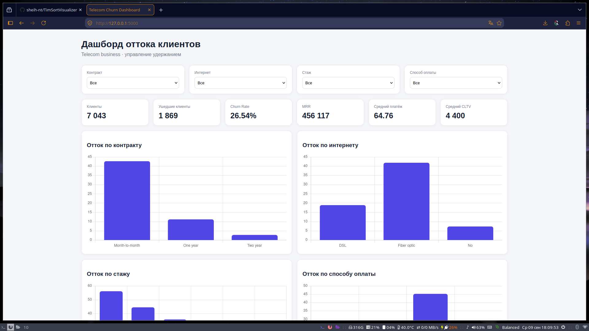
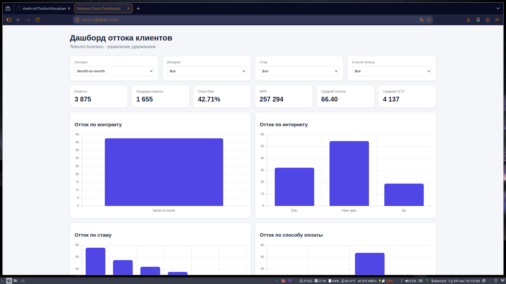
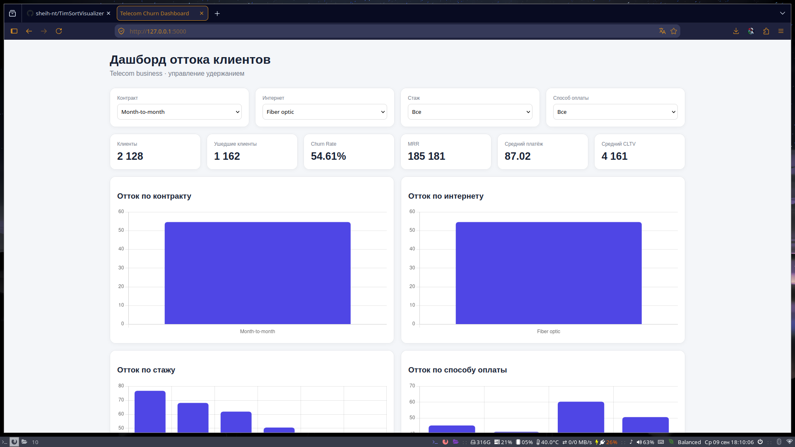
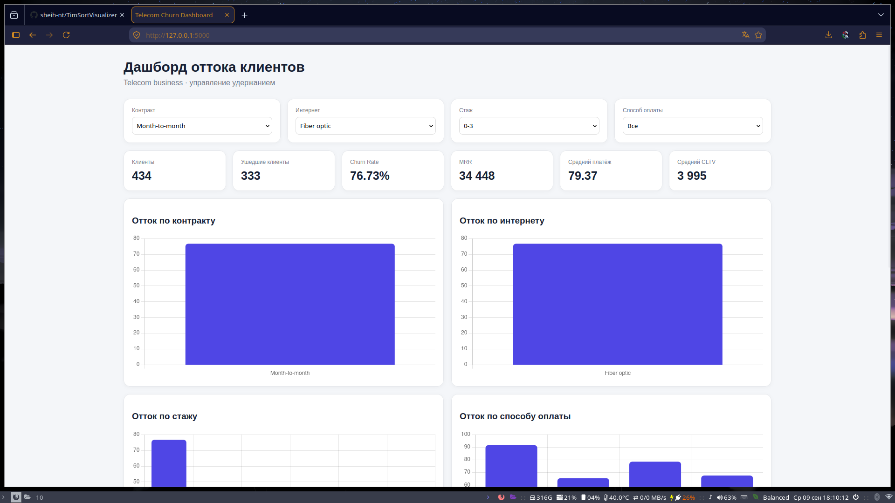
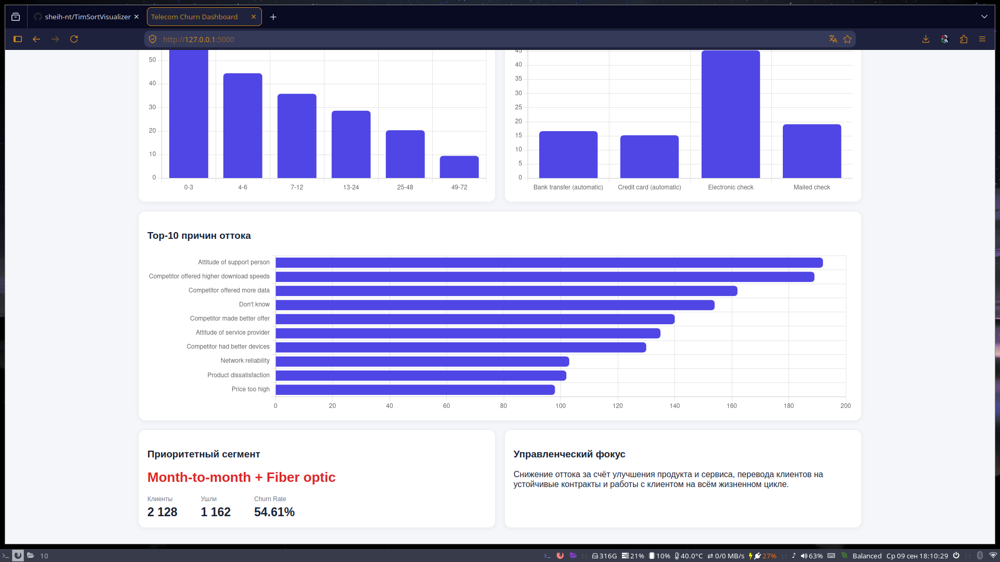

## Файл Data.xlsx
Тут ход работы, что то я смотрел, проверял питон


## Screenshots










## Структура проекта

telecom-churn/

.
├── app.py

├── data
│   └── data.csv
├── README.md
├── requirements.txt
└── templates
    └── index.html


## Запуск

Создать виртуальное окружение:

```bash
python -m venv venv
```
Скачать зависимости

Linux:
```bash
source venv/bin/activate
```
Windows:
```bash
venv\Scripts\activate
```
Установить зависимости:
```bash
pip install -r requirements.txt
```
Запустить приложение:
```bash
python app.py
```
После запуска открыть:
```
http://127.0.0.1:5000
````
